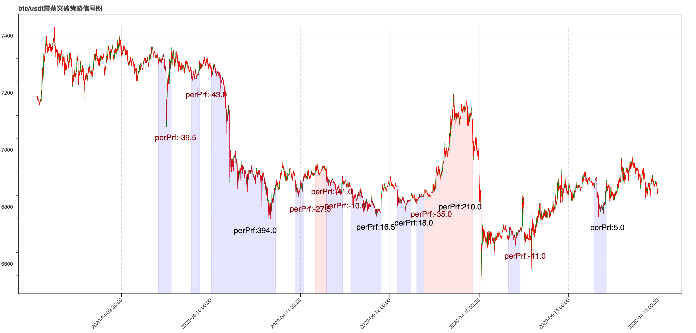
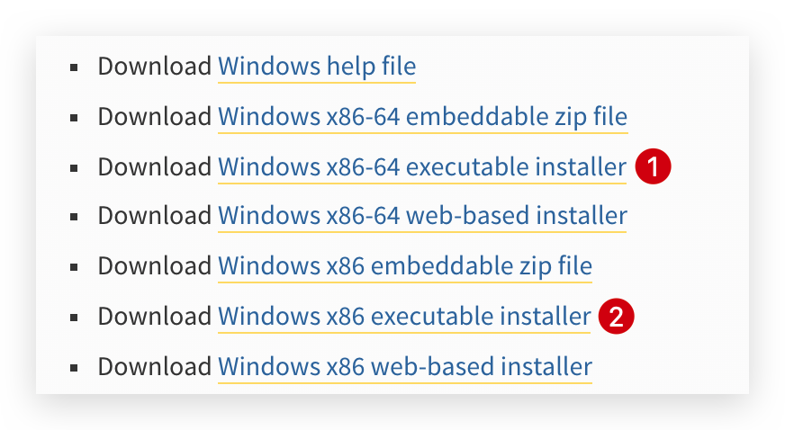
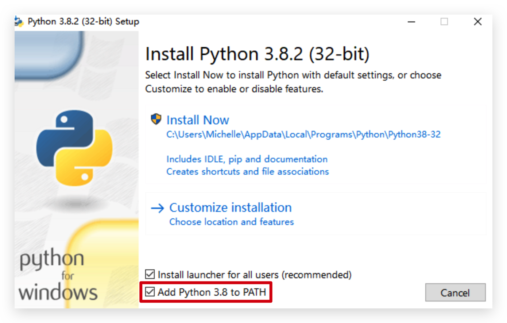
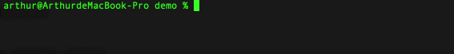
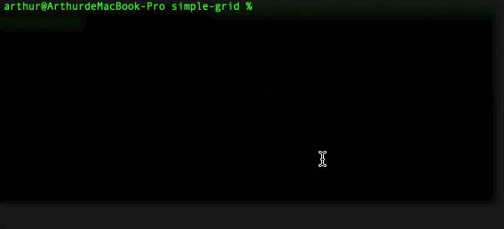
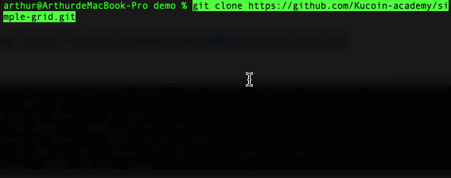

# 震荡突破策略

[](https://github.com/Kucoin-academy/Guide)
[](https://github.com/Kucoin-academy/shock-strategy)
[](https://github.com/Kucoin-academy/shock-strategy)
[](https://github.com/Kucoin-academy/shock-strategy/issues)

[](README_EN.md)
[](README_CN.md)

## 策略说明

上轨：过去30根K线的最高价

下轨：过去30根K线的最低价

区间幅度：（上轨 - 下轨）/ （上轨 + 下轨）

如果区间幅度小于阈值a，价格向上突破上轨，买入开仓，价格跌破下轨平仓

如果区间幅度小于阈值a，价格向下突破上轨，卖出开仓，价格突破上轨平仓  



**上图是对震荡策略的模拟操作，其中蓝色部分代表做空，红色代表做多，而区域的宽度代表了持仓时间，按时间顺序左边表示开仓，右边表示平仓，图中perPrf代表每个区域的收益情况，正数表示盈利，负数表示亏损**。

不难发现，把握好策略信号进行开仓平仓，总体的收益还是可以值得一试的。

**KuCoin**拥有**level3交易数据、强大的撮合引擎、针对api用户提供的手续费折扣**，同时提供**sandbox环境**作为数据测试支撑，帮助你规避风险。

我们仅提供一个简单且不完备的交易策略，使用时**请注意规避风险**，我们希望你能够**在sandbox环境配合其他参数或是策略进行测试调整，我们也不想你成为一个慈善家！！！**

当然，如果这个过程中，你遇到任何问题或是有赚钱的策略想要分享，请在**ISSUE**中反映，我们会努力及时响应。

:point_right: 如果你对该策略有兴趣，请点击**右上角star**，我们会根据star数来衡量策略的**受欢迎程度和后续优化优先级**，你也可以点击**右上角watching**通过接收更新通知来持续关注该项目。

## 如何使用

* 安装Python

  * Windows系统请前往[Python](https://www.python.org/downloads/windows/)官网自行安装，64位请选择1，32位请选择2。

    

    * 在开始安装时请注意将以下选项勾选：

      

  * MAC OS X安装

    * 打开命令终端，输入以下命令安装Homebrew（安装过程中需要输入**电脑密码**）：

      ```shell
      /usr/bin/ruby -e "$(curl -fsSL https://raw.githubusercontent.com/Homebrew/install/master/install)"
      ```

    * 在命令终端输入以下命令，安装Python3：

      ```shell
      brew install python
      ```

    * 在命令终端输入以下命令，确认是否安装成功：

      ```shell
      python3 --version
      ```

      

* 确保你已经安装git (mac 自带该软件,终端输入`which git`，查看安装位置)，未安装者请前往官网[git](https://git-scm.com/)安装。

* 在命令终端输入以下命令，安装项目依赖：

  ```shell script
  pip3 install kumex-python
  ```

  
  
* 在你需要跑策略的位置新建文件夹（例如桌面），**右键**点击新建的文件夹选择“**新建位于文件夹位置的终端窗口**”（**windows系统**：在右键点击文件夹点击**git Bash here**），在弹出的窗口中输入以下命令，克隆项目至本地，完成后本地会新增文件夹**shock-strategy**：
  
  ```shell
  git clone https://github.com/Kucoin-academy/shock-strategy.git
  ```
  
  
  
* 打开克隆好的项目（**shock-strategy**）文件夹，将**config.json.example**文件重命名为**config.json**，并用文本编辑器（比如**记事本**）打开**config.json**，然后完善相关的配置信息：

  ```
  {  
    "api_key": "api key",
    "api_secret": "api secret",
    "api_passphrase": "api pass phrase",
    // 是否是沙盒环境
    "is_sandbox": true,
    // 合约名称，比如：XBTUSDTM 
    "symbol": "contract name",
    // 杠杆倍数，比如：5
    "leverage": "Leverage of the order",
    // 开仓数量，比如：1
    "size": "Order size. Must be a positive number",
    // K线图基准，单位是分钟，比如：60，代表60min，即1h为基准的K线图
    "resolution": "kline resolution,count by minute,such as 60,it means 60min(1h) kline",
    // 阈值
    "valve": "valve"
  }
  ```

* Mac/Linux **在项目目录下**打开命令终端：

  ```shell
  cd shock-strategy
  ```
  * 用以下命令让你的策略运行起来：
  
    ```shell
    ./shock.py
    ```
  
* Windows **在项目目录下**打开命令终端：

  ```shell
  cd shock-strategy
  ```
  * 用以下命令让你的策略运行起来：
  
    ```shell
    py shock.py
    ```
  
  

